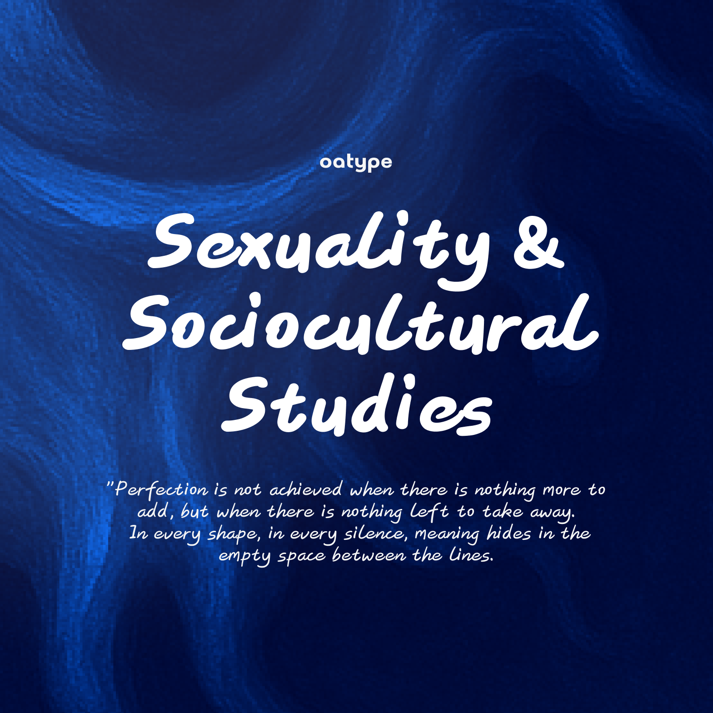
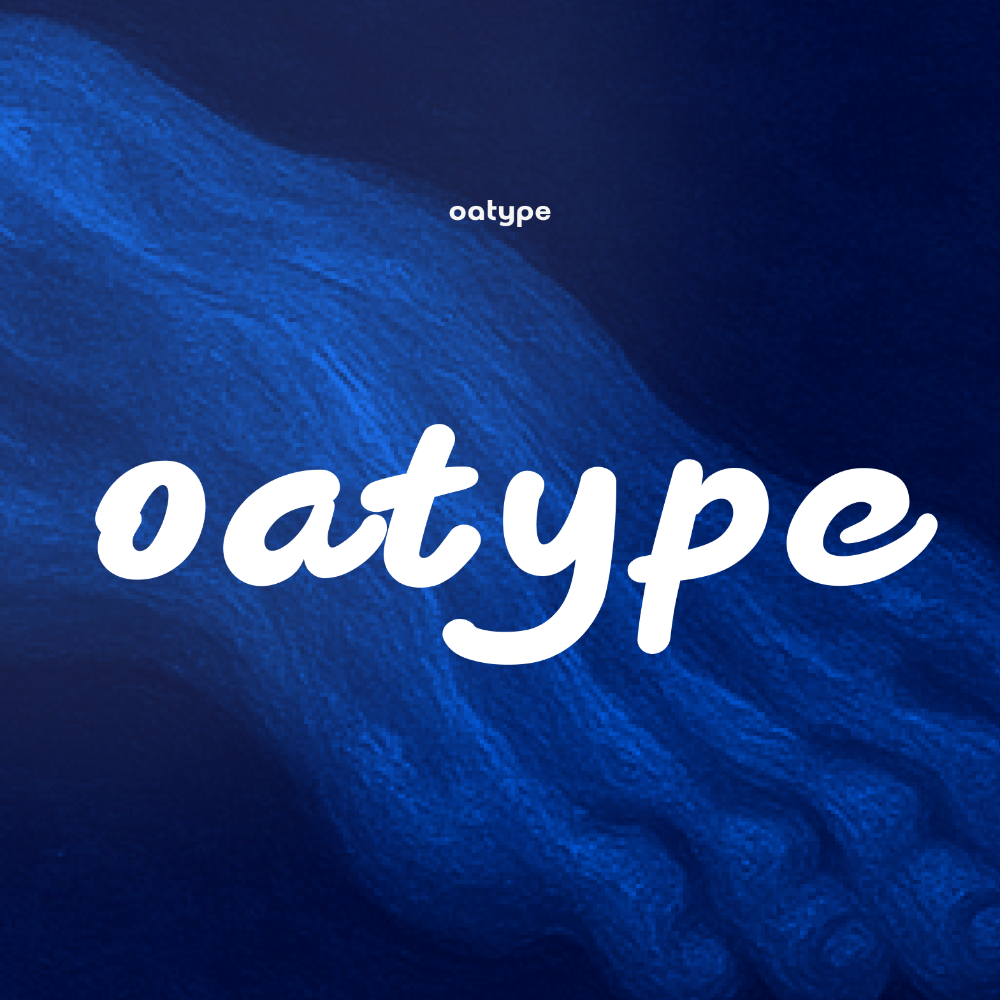
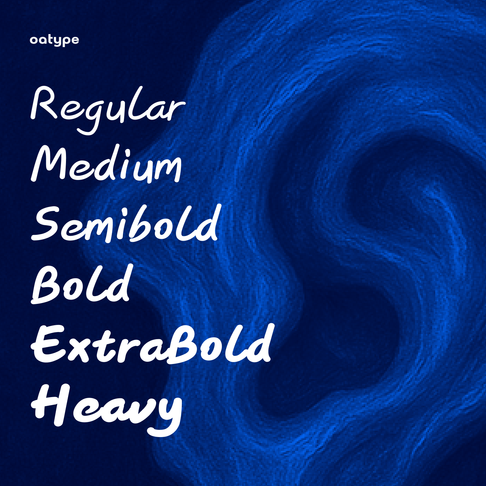

# Oat Hand

A warm and friendly handwritten font family perfect for creative designs, branding, and personal projects.

## Font Weights

- **Regular** - Body text, descriptions
- **Medium** - Emphasis, subheadings
- **SemiBold** - Subtitles, important info
- **Bold** - Headlines, brand names
- **Extrabold** - Large titles, posters
- **Heavy** - Display text, logos

## Usage

Perfect for:

- Creative titles and headlines
- Brand identity and logos
- Social media graphics
- Packaging design
- Personal projects

## License

SIL Open Font License (OFL) 1.1 - See [OFL.txt](OFL.txt)

## Contact

For questions, custom work, or licensing inquiries:

- Email: [lamzhonghang@gamil.com]
- resume: [https://iantype.com/]
- wechat: [eggpirate]
